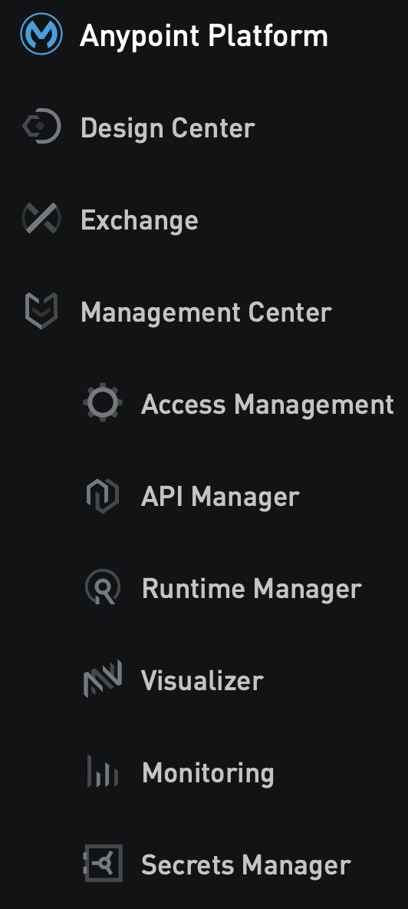
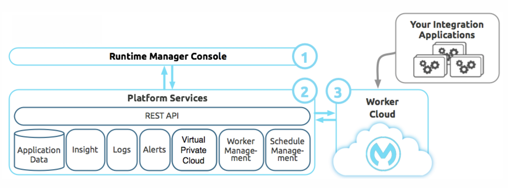

# Mulesoft
Knowledge repository for integrating with Mulesoft by [Alex MacDonald](https://intro.alexmacdonald.solutions). I provide vertical solutions for potential mulesoft customers in the [manufacturing](https://www.mulesoft.com/integration-solutions/api/manufacturing-edi-erp) vertical.

  

## Introduction 

[What is Mulesoft?](https://www.salesforce.com/blog/what-is-mulesoft/)

- Try Mulesoft with a 30 day trial [here](https://www.mulesoft.com/legal/terms/trial)

## Official links

[Mulesoft.com](https://www.mulesoft.com)

[Official Mulesoft documentation](https://docs.mulesoft.com/general/)

[Mulesoft Composer](https://www.mulesoft.com/platform/api/no-code-integration-tool)

[Login to Anypoint Platform](https://anypoint.mulesoft.com/login/) ++ [additional useful tools to enhance development](https://blogs.mulesoft.com/dev-guides/api-design/enhance-developers-anypoint-studio-experiences/)

[Radio Mulesoft, a podcast](https://podcasts.apple.com/be/podcast/radio-mulesoft/id1498103178)

- [Season 2 episode 1](https://podcasts.apple.com/be/podcast/apis-unplugged-season-2-episode-1-api-questions-for/id1498103178?i=1000506223990) started off with a very interesting story on how [this happened](https://cybernews.com/news/70tb-of-parler-users-messages-videos-and-posts-leaked-by-security-researchers/) (**hint: bad API design!**)

[Mulesoft Youtube Channel](https://www.youtube.com/user/mulesoftvids)

[Mulesoft white papers](https://www.mulesoft.com/integration-resources?type[0]=Whitepaper)

[Official Mulesoft articles](https://www.mulesoft.com/resources/articles)

- Find the best practices

### Youtube

[What is API-led Connectivity?](https://www.youtube.com/watch?v=WYociWuCInE)

[What is Mulesoft? Tutorial playlist on Youtube](https://www.youtube.com/watch?v=lRpJtMfa4zs&list=PLfEAetjBY9s5gywT2hC95rnZaW5CEZis-)

## You & Mulesoft

[Work at Mulesoft!](https://www.mulesoft.com/careers)

[Mulesoft meetups](https://meetups.mulesoft.com)

[Customer case studies](https://www.mulesoft.com/case-studies)

[Build a connector](https://www.mulesoft.com/webinars/saas/building-powerful-connector-scratch) for your app! And get it [certified by Mulesoft](https://www.mulesoft.com/platform/cloud-connectors/certified)

## Components of Mulesoft

Anypoint Components            |  Anypoint architecture
:-----------------------------:|:-------------------------:
              |  

[API Manager](https://docs.mulesoft.com/api-manager/2.x/)

[Exchange](https://www.mulesoft.com/exchange/)

## Training

### Official

[API-led Connectivity](http://workshop.tools.mulesoft.com/modules/)

[Mulesoft tutorials](https://developer.mulesoft.com/tutorials-and-howtos)

[Top tutorials for new developers](https://blogs.mulesoft.com/dev-guides/how-to-tutorials/getting-started-with-mulesoft/)

### Third party

[Free Mulesoft self-paced training](https://training.mulesoft.com/course-catalog?results=true&courseFormat=Self-paced)

[TutorialsPoint](https://www.tutorialspoint.com/mulesoft/index.htm)

[Vanchiv tutorials](https://vanchiv.com/category/integration/mulesoft-tutorial-and-guide/)

## How to integrate with X

[Mulesoft connector documentation - yes, all of them](https://docs.mulesoft.com/connectors/)

[Top 10 Mulesoft connectors](https://blogs.mulesoft.com/dev-guides/how-to-tutorials/top-download-connectors-anypoint-platform/)

[Mulesy - sample POCs](https://mulesy.com/mulesoft-pocs/)

### salesforce

  

[salesforce integration general practices](https://www.mulesoft.com/resources/salesforce)

[salesforce connector documentation](https://docs.mulesoft.com/salesforce-connector/0.3.9/)

#### Youtube

[Querying salesforce with Mulesoft](https://www.youtube.com/watch?v=TeAHUjILPJA)

[salesforce & Mulesoft workshop](https://www.youtube.com/watch?v=NplNJIdT1y4&list=PL5jx2tzaZzrACn0PHDslh_S7cMO4FIk86)

[batch request](https://www.youtube.com/watch?v=6AYGCfQCOCQ)

[syncing data to AWS S3](https://www.youtube.com/watch?v=b3Z9pWi2lkk)

### Microsoft

  

[SQL Server - 1](https://mulesy.com/microsoft-sql-server-with-mule/)

[SQL Server - 2](https://dzone.com/articles/connecting-to-ms-sql-server-with-mulesoft)

[Azure storage](https://mulesy.com/integrating-azure-storage-with-mulesoft/)

[Azure Service Bus connector documentation](https://docs.mulesoft.com/microsoft-azure-sb-connector/3.1/) + [how to-1](https://www.whishworks.com/blog/mulesoft/integration-of-mule-esb-with-microsoft-azure/) & [how to-2](https://www.ricston.com/blog/mulesoft-connectivity-with-microsoft-azure-service-bus/)

[Azure data lake](https://blogs.mulesoft.com/dev-guides/how-to-tutorials/create-customer-360-mulesoft-azure-data-lake-store/)

### GCP

  

[Mulesoft + BigQuery](https://www.apisero.com/mulesoft-bigquery-series-2/)

[Setup VPN from Mulesoft to Google Cloud](https://blogs.mulesoft.com/api-integration/security/setting-up-vpn-with-google-cloud/)

[Pub/Sub - Youtube](https://www.youtube.com/watch?v=74Rb1to0vNc)

### SAP

  

#### Youtube

[SAP Connector demo](https://www.youtube.com/watch?v=1xenBmdVNSo)

[SAP configuration](https://www.youtube.com/watch?v=tf_qS-VSMHw)

[Send iDoc with SAP](https://www.youtube.com/watch?v=hM98SZXQorU)

[Integration made Easy](https://www.youtube.com/watch?v=xNgL2vVLsZw)

[Detailed explanation](https://www.youtube.com/watch?v=nrfKgiJvVuw)

### Oracle

  

[Peoplesoft](https://www.mulesoft.com/resources/api/oracle-peoplesoft-integration)

[EBS connector documentation](https://docs.mulesoft.com/oracle-ebs-122-connector/2.1/)

[Eloqua](http://cdn.cdata.com/help/DUF/mule/)

[Fusion/Cloud ERP](https://www.astcorporation.com/mulesoft-oracle-connector/)

#### Youtube

[EBS](https://www.youtube.com/watch?v=aO48A17RQqg)

[Oracle Database](https://www.youtube.com/watch?v=EEDl0Sn8N5I)

[Query Oracle Database](https://www.youtube.com/watch?v=AW6_unMvxYY)

[Insert to Oracle Database](https://www.youtube.com/watch?v=Rxz6CnC0L1o)

[Sales Cloud](https://www.youtube.com/watch?v=Fd-XHKQCJPA)

[Netsuite](https://www.youtube.com/watch?v=venI2PBqgEY)

### Twilio

  

[Twilio connector documentation](https://docs.mulesoft.com/twilio-connector/3.0/)

[Twilio dev-guide](https://blogs.mulesoft.com/dev-guides/how-to-tutorials/twilio-cloud-connector-2/)

### AWS

  

[General resources](https://blogs.mulesoft.com/tag/aws-integration/)

[Extending AWS with Mulesoft - white paper](https://www.mulesoft.com/webinars/api/aws-integration-developer)

#### Youtube

[AWS S3 with Mulesoft](https://www.youtube.com/watch?v=VlPmg2lVvzM)

[Redshift](https://www.youtube.com/watch?v=uAfEg80SqOA&t=9s)

[lambda](https://www.youtube.com/watch?v=Fad_shR9hMw)

### ServiceNow

  

[ServiceNow example-1](https://www.apisero.com/integration-between-servicenow-and-mulesoft/)

[JIRA + ServiceNow](https://www.mulesoft.com/resources/jira-servicenow)

[ServiceNow example-2](https://dzone.com/articles/mulesoft-integration-with-servicenow)

[ServiceNow - official documentation](https://docs.mulesoft.com/servicenow-connector/6.8/)

### Other SaaS

[Docusign](https://www.whishworks.com/blog/mulesoft/integrating-docusign-with-mulesoft/)

### Open Source/technology/generic

[File based integrations](https://blogs.mulesoft.com/dev-guides/how-to-tutorials/howto-file-based-integrations-and-transfer/)

[kafka](https://www.royalcyber.com/blog/apache-kafka/apache-kafka-integration-with-mulesoft/)

#### General REST APIs

  

[Consuming REST in Mulesoft - Youtube](https://www.youtube.com/watch?v=fLJnezzVU4s)

#### APIs to play with

[World Atlas](http://restcountries.eu)

[Star Wars API](https://swapi.dev)

[News API](https://newsapi.org)

[Census](https://www.census.gov/data/developers/data-sets.html)

[The Department of Justice](https://www.justice.gov/developer/api-documentation/api_v1)

[API-led Connectivity slides](https://www.slideshare.net/mulesoft/transform-your-business-with-apiled-connectivity)

## Administering Mulesoft

[CloudHub connector](https://anypoint.mulesoft.com/exchange/org.mule.modules/mule-module-cloudhub/)

- This provides the ability to interact with CloudHub from within a Mule application. The operations allow you to deploy, start, stop, and update applications as well as send notifications from your Mule application to CloudHub.

[Licensing & sizing](https://www.infomentum.com/mulesoft-pricing-licence-cost)

[Deployment options](https://docs.mulesoft.com/runtime-manager/deployment-strategies#cloudhub-deployments)

[Increasing JVM memory](https://help.mulesoft.com/s/article/Increasing-JVM-memory-heap-in-Anypoint-Studio-to-avoid-OutOfMemory-issues)

[Object store on Mulesoft - Youtube video](https://www.youtube.com/watch?v=gXZMxTZoXCQ)

[CI/CD - high level - Youtube video](https://www.youtube.com/watch?v=c_Mlifcikj8)

[Setting up Anypoint studio for the first time](https://www.youtube.com/watch?v=cZUw2T0D7PU)

[Using Github with Anypoint studio - Youtube](https://www.youtube.com/watch?v=35fHx23zjP0)

### Mulesoft on other clouds

[Runtime Fabric on AWS](https://stackoverflow.com/questions/57526007/deploying-mulesoft-application-using-azure-devops)

[Running Mulesoft on Google Kubernetes Engine](https://www.youtube.com/watch?v=tJDSQ1EUKUI)

[Running Mulesoft on Azure](https://docs.mulesoft.com/runtime-fabric/1.8/install-azure)

[Deploy Mulesoft with Azure DevOps](https://dzone.com/articles/deploying-mulesoft-using-azure-devops) + [details](https://stackoverflow.com/questions/57526007/deploying-mulesoft-application-using-azure-devops)

## Certification

### Offical

[Preparing - what you need to know, by Mulesoft](https://www.mulesoft.com/webinars/api/preparing-for-mulesoft-certifications)

[Exam details](https://help.learn.mulesoft.com/hc/en-us/categories/115001475248-Certification)

[Level 1 exam summary](https://training.mulesoft.com/certification/developer-mule4-level1)

[5 things to know about getting certified](https://blogs.mulesoft.com/learn-apis/integration-training/learn-about-mulesoft-training-and-certification/)

[All Mulesoft Certifications](https://training.mulesoft.com/certification)

### Third party

[Mulesy - general guide](https://mulesy.com/0-mulesoft-certifications/)

[Udemy - Mulesoft level 4](https://www.udemy.com/course/mulesoft-certified-developer-mule-4/)

[Udemy - Mulesoft Platform Architect](https://www.udemy.com/course/ultimate-mulesoft-certified-platform-architect-course/)

## Misc

[Ross Mason, the founder of Mulesoft](https://www.forbes.com/sites/stuartanderson/2016/06/04/ross-mason-immigrant-founder-of-1-5-billion-mulesoft-on-job-market-and-managing-a-global-company/?sh=608acfc547e3)

[Workshop presentations](https://martinhumpolec.cz/mulesoft-workshop/)

[HCM best practices - white paper](https://www.mulesoft.com/lp/whitepaper/api/hcm-integration-best-practices)

